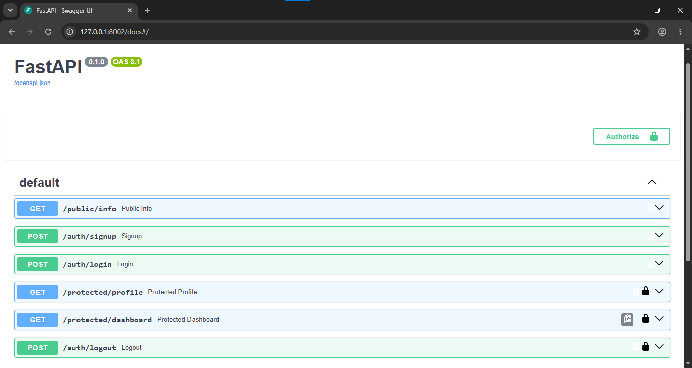

# flyrank-auth-api

A backend authentication API built with **FastAPI** and **Supabase Auth**, covering signup, login, logout, and JWT-protected routes. Built as part of FlyRank's Backend AI Engineering track, Assignment BE-03: "Auth - Login & Protect."

## Features

- Email/password signup and login via Supabase Auth
- JWT-based authentication using Bearer tokens
- Protected routes that verify tokens against Supabase before returning data
- Interactive API docs (Swagger UI) with a working "Authorize" flow for testing protected endpoints

## Setup

1. Clone the repo and navigate into the project folder.
2. Create a `.env` file in the project root with the following variables:

   ```env
   SUPABASE_URL=your-supabase-project-url
   SUPABASE_KEY=your-supabase-anon-or-service-key
   PORT=8002
   ```

   You can find `SUPABASE_URL` and `SUPABASE_KEY` in your Supabase project under **Settings → API**.

3. Install dependencies:

   ```bash
   pip install -r requirements.txt
   ```

   (If there's no `requirements.txt` yet, install at minimum: `fastapi`, `uvicorn`, `supabase`, `python-dotenv`.)

## Running the server

```bash
python -m uvicorn main:app --reload --port 8002
```

The API will be available at `http://127.0.0.1:8002`, with interactive docs at `http://127.0.0.1:8002/docs`.

## API Reference

| Method | Endpoint | Auth Required | Description |
|--------|----------|:---:|-------------|
| GET | `/public/info` | No | Returns basic public info about the API — no authentication needed. |
| POST | `/auth/signup` | No | Creates a new user account with an email and password via Supabase Auth. |
| POST | `/auth/login` | No | Authenticates an existing user and returns a Supabase-issued JWT access token. |
| GET | `/protected/profile` | Yes | Returns the authenticated user's profile (id, email, created_at), verified from the Bearer token. |
| GET | `/protected/dashboard` | Yes | Example protected route demonstrating token verification on a second endpoint. |
| POST | `/auth/logout` | Yes | Signs the current user out via Supabase Auth and invalidates their session. Returns `204 No Content`. |

## Authentication

Protected routes expect an `Authorization: Bearer <token>` header, where `<token>` is the `access_token` returned by `/auth/login`. In Swagger UI, click **Authorize**, paste the token, and all protected routes become callable directly from `/docs`.

## Swagger UI



*Full route list showing the six endpoints, with lock icons on the three protected routes (`/protected/profile`, `/protected/dashboard`, `/auth/logout`) and the Authorize button for testing with a real token.*

## Notes

- Email confirmation is disabled in this Supabase project for development convenience, so signups are immediately usable without a confirmation step.
- `.env` is excluded from version control via `.gitignore` — never commit real Supabase keys.
